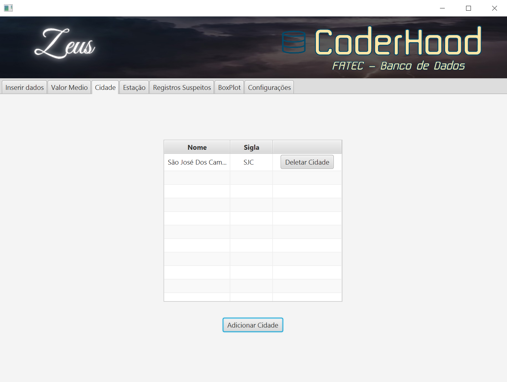
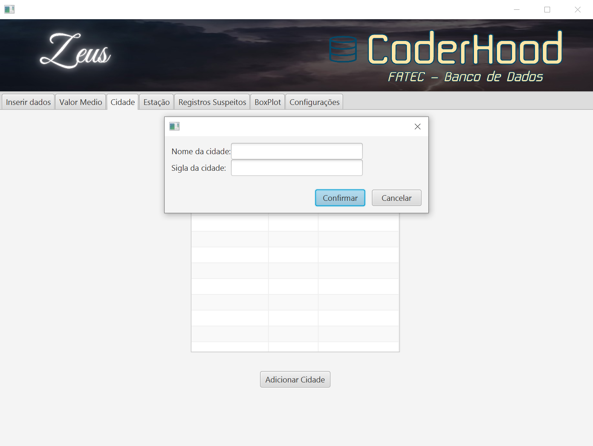
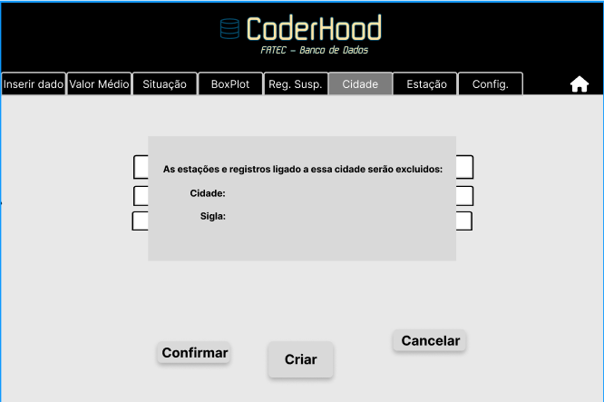
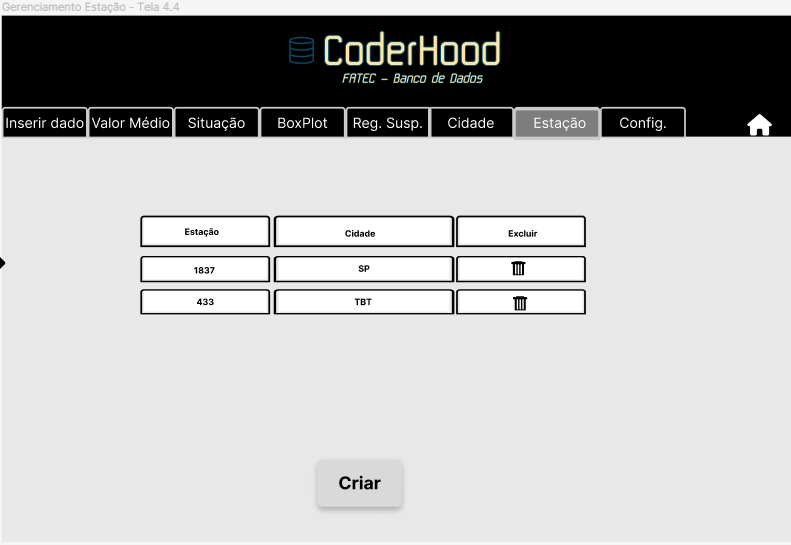
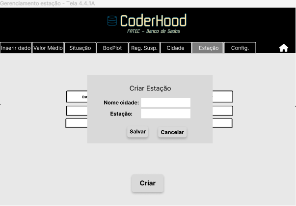
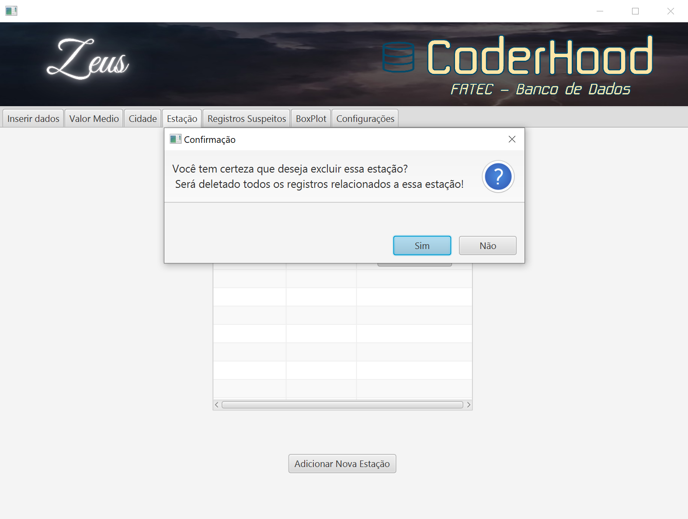
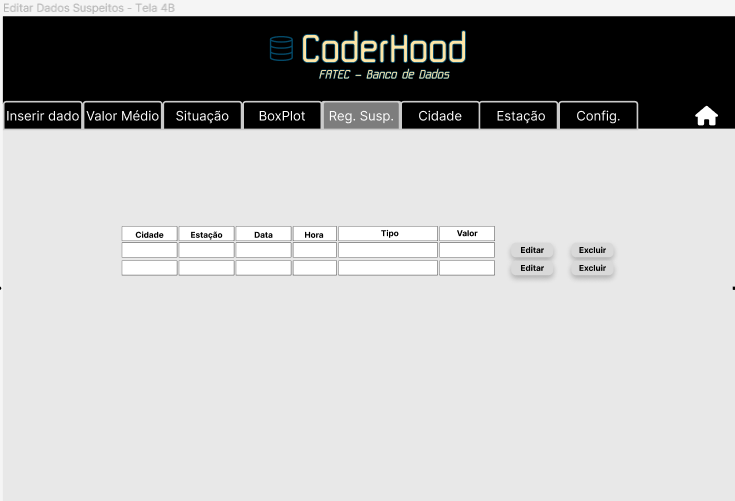
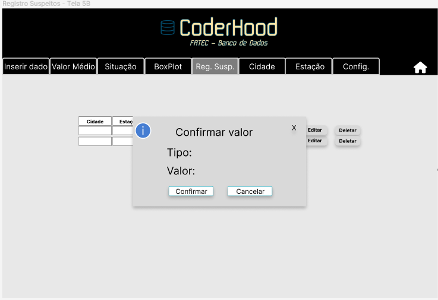
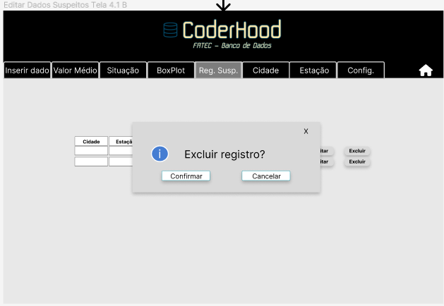

# Backlog Sprint 2

- [Sprint 2:](#sprint-2)
  - [Gerenciamento de cidades](#gerenciamento-de-cidades)
  - [Gerenciamento de estações](#gerenciamento-de-estações)
  - [Tratamento de registros suspeitos](#tratamento-de-registros-suspeitos)  

- [Sprint 3:](#sprint-3)
  - [Relatório de situação](#relatório-de-situação)
  - [Dados BoxPlot](#dados-boxplot)

## Sprint 2

### Gerenciamento de Cidades:

**História do usuário:**

Como meteorologista, eu quero gerenciar cidades, podendo assim escalar e manejar as cidades cadastradas.

**Regras de negócio:**
- Criar uma nova cidade.
- Deletar uma cidade.
- Não será possível repetir a sigla de uma cidade que já exista ao criar.
- Ao deletar será deletado todos as estações e registros ligado a essas cidades.

**Interface do usuário:**

##

### Gerenciamento de Estações:

**História do usuário:**
Como meteorologista, eu quero gerenciar estações, podendo assim escalar e manejar estações cadastradas.

**Regras de negócio:**
- Criar uma nova estação.
- Deletar uma estação.
- Não será possível repetir um número de estação que já exista ao criar.
- Ao deletar será deletado todos os registros ligados a essa estação.

**Interface do usuário:**

 

 

##

### Tratamento de Registros Suspeitos:

**História do usuário:**
Como meteorologista, eu quero gerenciar registros que contêm valores suspeitos, afim de poder revisar os registros identificados como suspeitos ou deletá-los.

**Regras de negócio:**
 - Ao alterar o valor suspeito para um valor dentro do estipulado nas configurações, ele será salvo.
 - Ao alterar o valor suspeito para um valor fora do estipulado nas configurações, será retornado um erro.
 - Ao deletar o registro com valor suspeito, os demais registros relacionados serão deletados.

 **Interface do usuário:**

##

## Sprint 3

### Relátorio de situação:

**História do usuário:**
Como meteorologista, posso visualizar relatório de situação, afim de verificar os as últimas medidasde cada cidade.

**Regras de negócio:**
- Ao selecionar a aba de *Situação* será visualizado as últimas medidas de cada cada.

 **Interface do usuário:**
 

##

 ### Dados BoxPlot:

**História do usuário:**
Como meteorologista, posso gerar dados necessários para a criação de um gráfico boxplot, para entender melhor as variações e tendências climáticas.

**Regras de negócio:**
- Deve ser selecionado uma estação, uma data inicial eu uma data final.
- Será gerado para cada váriavel climatica("Temperatura Média", "Umidade Média", "Velocidade do Vento", "Direção do Vento", "Chuva"): 
  - Mínimo
  - Primeiro quartil
  - Mediana
  - Terceiro quartil
  - Máximo

- Será possível exportar em formato excel(.xlsx)

 **Interface do usuário:**
 

