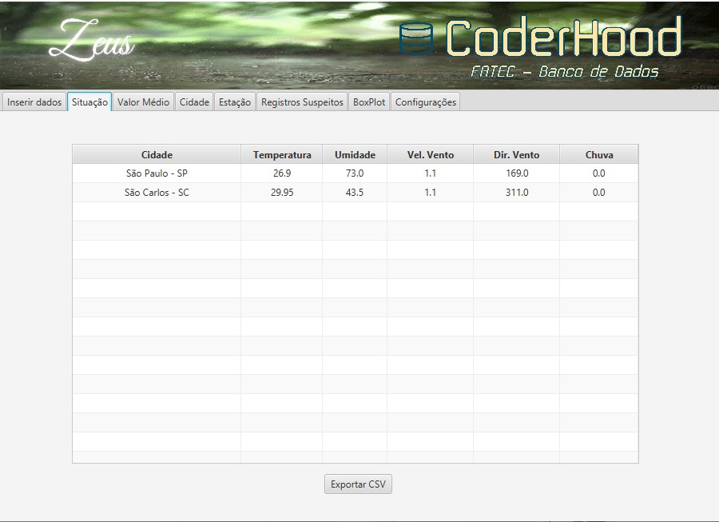
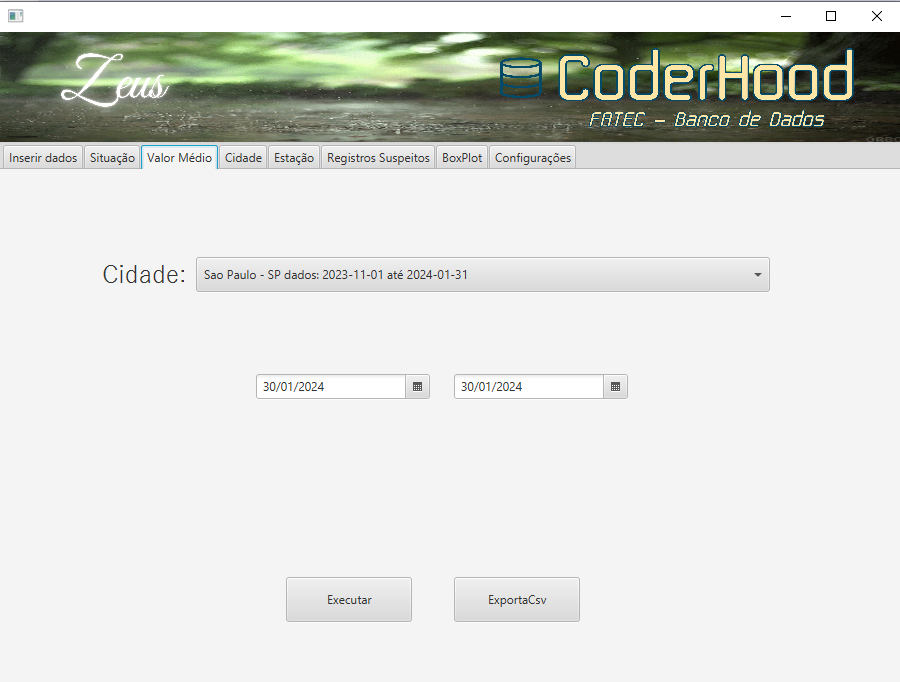
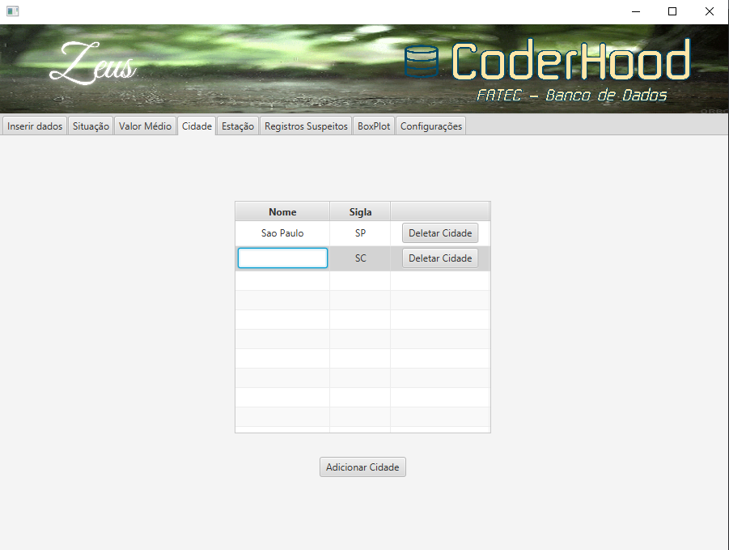
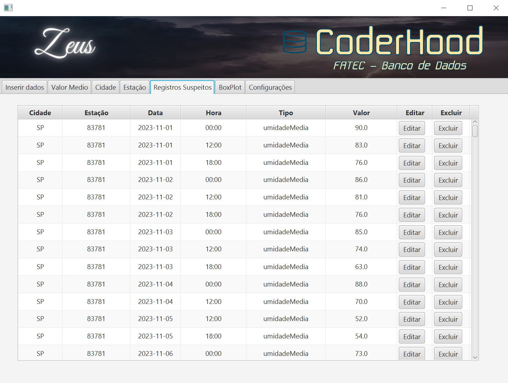
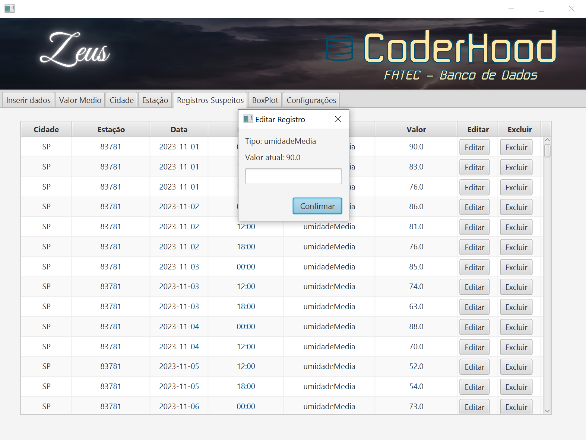
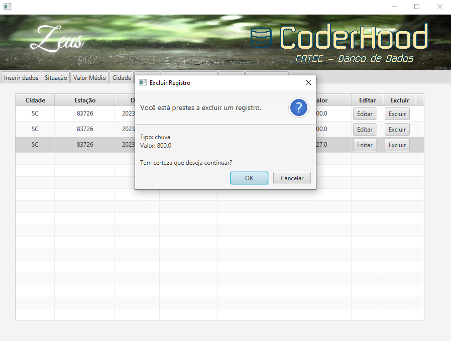

# Manual Zeus

Manual produzido pela equipe Coderhood - FATEC São José dos Campos - Prof. Jessen Vidal

Qualquer dúvida entrar em contato (12) 98242-7304.

- [Instalação do Java 17.0.10.](#instalação-do-java-17010)
- [Instalação e configuração do PostgreSQL 16.3.](#instalação-e-configuração-do-postgresql-163)
- [Configuração do Zeus.](#configuração-do-zeus)

## Instalação do Java 17.0.10:

Para baixar o Java 17.0.10, visite o seguinte link: [Download Java 17.0.10](https://www.oracle.com/java/technologies/javase/jdk17-archive-downloads.html)

## Instalação e configuração do PostgreSQL 16.3:

Para baixar e configurar o PostgreSQL 16.3, siga estas etapas:

1. Visite o seguinte link: [Download PostgreSQL 16.3](https://www.enterprisedb.com/downloads/postgres-postgresql-downloads)

2. Selecione as seguintes opções:

.png)
  

3. Senha padrão: `root`

.png)
  

4. Porta: `5432`

.png)
  

5. Locale: `Default locale`

.png)
  

Se o PostgreSQL não for instalado corretamente, um erro será exibido:

.png)
  

## Configuração do Zeus:

Ao iniciar o aplicativo pela primeira vez, um erro será exibido, pois é necessário definir a faixa de valores para carregar o CSV:

.png)
  

Para definir a faixa de valores, vá até a aba de configurações:

.png)
  
## Fazer upload do arquivo CSV.

Para fazer upload do arquivo CSV, abra o Zeus, vá até a aba de Inserir Dados, clique em selecionar arquivo.(imagens/image.png).

.png)
  

Selecione o arquivo CSV que você deseja fazer upload e clique em "Salvar".
Se a sigla ainda não estiver relacionada a uma cidade, aparecerá uma mensagem para cadastrar a sigla. .png)
  

Se o upload for bem-sucedido, você verá uma mensagem de sucesso..png)
  

## Situação.
Clique na aba Situação, o usuário receberá uma tabela com as informações das ultimas cidades que
 constam no banco de dados, com o registro mais recente de cada tipo de dado.

   
  

Para saber a data e a hora do registro o usuario deve posicionar o cursor do mouse por cima do dado.
  .png)
  

Caso o usuario deseje, ele pode exportar um arquivo CSV clicando no botão exportar. O Registro de Situação será exibido como na imagem abaixo: 
  
  

## Valor Médio.

Clique na aba do Valor Médio escolha a cidade desejada na lista suspensa qie ira aparecer na tela
  
  

Após escolher a cidade, o usuário devera escolher a data inicial:  
  
  
E a data final:
.  
  

Apos a escolha do periodo , aparecerá os botoes
de Executar eo de Exportar.
  
  

Ao clicar o botão de executar a tabela de valor médio será exibido na tela.  
.png)
  

Ao clicar o botão de Exportar o CSV a tabela de valor médio ira gerar um relatorio em excel.  

  

## Gerenciamento de Cidades.

Clique na aba Cidade, tera a opção de: adicionar,editar, deletar as cidades disponiveis em seu banco de dados.
 
  
Para editar, clique duas vezes no nome da cidade pretendida e assim uma caixa de texto aparecera para que o usuario possa inserir um novo nome.
 
  

Para adicionar uma cidade, clique em adicionar cidade e preencha as informações necessárias: Cidade e Sigla.  .png)
  

Para deletar uma cidade, selecione a cidade e clique em deletar. Aparecerá uma mensagem de confirmação.
  .png)
  

Ao cadastrar uma sigla que a mesma ja esta cadastrada aparecera uma mensagem.
  
  

## Gerenciamento de Estações.

Clique na aba Estação, aparecera as informações das estações cadastradas, tera a opção de nomear estação, descrição, deletar e adicionar estações.  .png)
  

Para nomear, fazer alguma descrição e adicionar as coordenadas de uma estação, clique na respectiva caixa de mensagem, preencha com as informações necessárias e aperte enter.  .png)
  

Para adicionar uma estação, clique em adicionar estação e preencha as informações necessárias:  .png)
  

Para deletar uma estação, clique em deletar estação, aparecerá uma mensagem de confirmação.  .png)
  

## Registros Suspeitos 

Clique na aba Registros Suspeitos, aparecera os 
registros com valores descrepantes  
  
  

O usuario pode editar a onde estiver o registro com os valores contraditorios.
  
  

O usuario pode tambem ao inves de editar e pode excluir o registro.
  
  

## Boxplot 

Clique na aba Boxplot (boxplot é uma ferramenta gráfica utilizada na estatística para exibir a distribuição de um conjunto de dados)
o usuario pode escolher a cidade com seus registros eo perido desejado 
  
  

O usuario pode escolher a cidade desejada na lista suspensa que ira aparecer na tela
  
  

Depois pode escolher o periodo desejado para pesquisa
  
  

Apos escolher o periodo especifico aparecera o botão de excutar. 
  
  

Ao apertar o botão de executar aparecer as informações referente ao periodo exigido
  
  

O usuario ao clicar no exportar que aparecera na tela ,gerara um aviso que o CSV foi exportado para a pasta de dowloads.
  
  

O relatorio aparecera em CSV para converter em uma tabela em excel, para formatar o mesmo selecione a 1ª coluna e clique na aba dados
  
  

O usuario ao acessar a aba dados clique no icone texto para colunas e aparecera o assistente para conversão de texto em colunas e clique 1 vez para avançar e marque na opção vírgula na caixa de delimitadores,depois clique em concluir. 
  
  

O Relatorio estara formatado como uma tabela em excel. 
  
  

Para mostrar um grafico da tabela que o usuario formatou anteriormente, vá a aba inserir,selecione a linha que irá transformar em um gráfico , em seguida clique no ícone que irá mostrar o tipo de gráfico e selecione o grafico de Box Plot. 
  
  

Fazendo esse procedimentos com todos os registros da tabela,
o usuário chegara noseguinte resultado.
 
  

Caso necessite de suporte, por favor, entre em contato via e-mail:  
coderhood.fatec@gmail.com

 
  