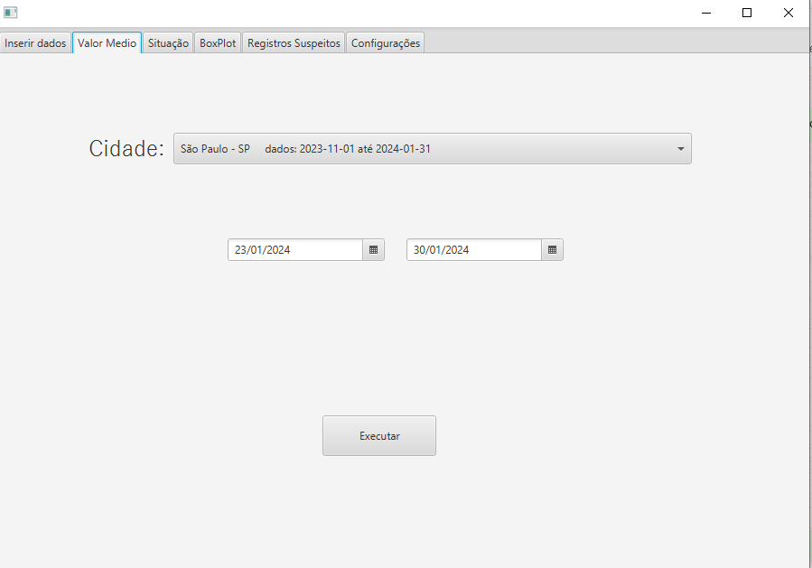
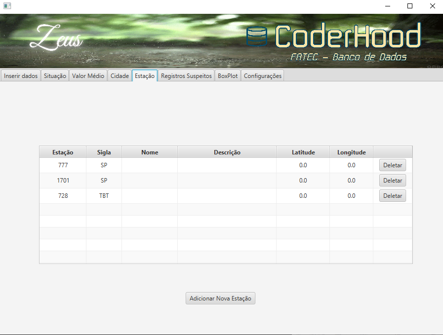

# Manual Zeus

Manual produzido pela equipe Coderhood - FATEC São José dos Campos - Prof. Jessen Vidal

Qualquer dúvida entrar em contato (12) 98242-7304.

- [Instalação do Java 17.0.10.](#instalação-do-java-17010)
- [Instalação e configuração do PostgreSQL 16.3.](#instalação-e-configuração-do-postgresql-163)
- [Configuração do Zeus.](#configuração-do-zeus)

## Instalação do Java 17.0.10:

Para baixar o Java 17.0.10, visite o seguinte link: [Download Java 17.0.10](https://www.oracle.com/java/technologies/javase/jdk17-archive-downloads.html)

## Instalação e configuração do PostgreSQL 16.3:

Para baixar e configurar o PostgreSQL 16.3, siga estas etapas:

1. Visite o seguinte link: [Download PostgreSQL 16.3](https://www.enterprisedb.com/downloads/postgres-postgresql-downloads)

2. Selecione as seguintes opções:

3. Senha padrão: `root`

4. Porta: `5432`

5. Locale: `Default locale`

Se o PostgreSQL não for instalado corretamente, um erro será exibido:

## Configuração do Zeus:

Ao iniciar o aplicativo pela primeira vez, um erro será exibido, pois é necessário definir a faixa de valores para carregar o CSV:

.png)

Para definir a faixa de valores, vá até a aba de configurações:

.png)

---

## Fazer upload do arquivo CSV.

 

Para fazer upload do arquivo CSV, abra o Zeus, vá até a aba de Inserir Dados, clique em selecionar arquivo. 

 

 

Selecione o arquivo CSV que você deseja fazer upload e clique em "Salvar".
Se a sigla ainda não estiver relacionada a uma cidade, aparecerá uma mensagem para cadastrar a sigla.

 

 

Se o upload for bem-sucedido, você verá uma mensagem de sucesso.

 

 

## Situação.

## Valor Médio.

 

Clique na aba Valor Médio, abrirá a tela com os espaços para inserir as informações necessária: Cidade, data e hora.
Após o preenchimento das informações, clique em executar.

 

 

O tabela de valor médio será exibido na tela.

 

 

## Gerenciamento de Cidades.

 

Clique na aba Cidade, tera a opção de deletar e adicionar cidades.

 

 

Para adicionar uma cidade, clique em adicionar cidade e preencha as informações necessárias: Cidade e Sigla.

 

 

Para deletar uma cidade, selecione a cidade e clique em deletar. Aparecerá uma mensagem de confirmação.

 

 

## Gerenciamento de Estações.

 

Clique na aba Estação, aparecera as informações das estações cadastradas, tera a opção de nomear estação, descrição, deletar e adicionar estações.

 

 

Para nomear, fazer alguma descrição e adicionar as coordenadas de uma estação, clique na respectiva caixa de mensagem, preencha com as informações necessárias e aperte enter.

 

 

Para adicionar uma estação, clique em adicionar estação e preencha as informações necessárias:

 

 

Para deletar uma estação, clique em deletar estação, aparecerá uma mensagem de confirmação.

 

